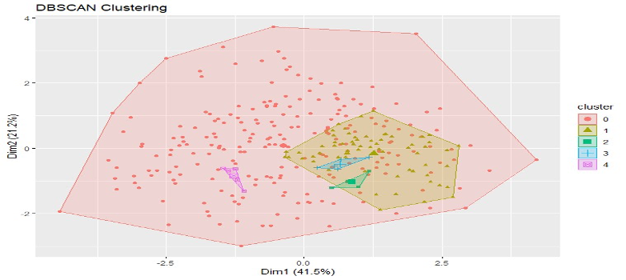
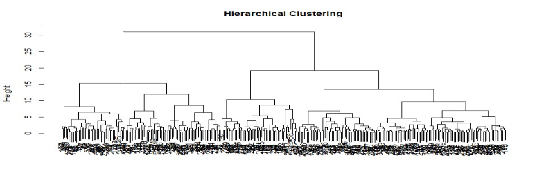
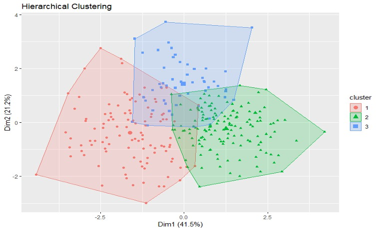
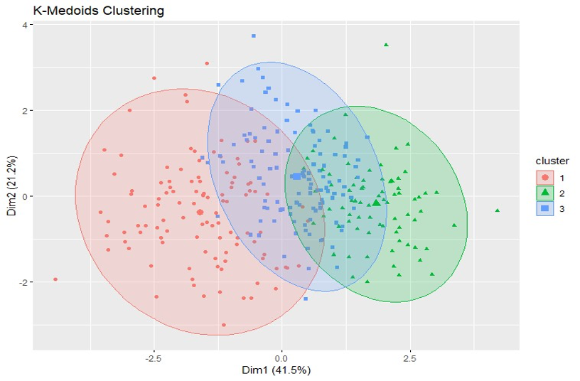

# Clustering Heart Disease Patients

## 📌 Project Overview
This project applies **unsupervised machine learning techniques** to cluster heart disease patients based on their medical records. The goal is to identify patient groups with similar health profiles, which could help doctors tailor treatments more effectively.

## 📑 Table of Contents
- [Dataset Overview](#📊-dataset-overview)
- [Data Preprocessing](#🔧-data-preprocessing)
- [Clustering Techniques](#🔍-clustering-techniques)
  - [K-Means Clustering](#1️⃣-k-means-clustering)
  - [DBSCAN (Density-Based Clustering)](#2️⃣-dbscan-density-based-clustering)
  - [Hierarchical Clustering](#3️⃣-hierarchical-clustering)
  - [K-Medoids Clustering (PAM)](#4️⃣-k-medoids-clustering-pam)
- [Feature Impact Analysis](#📈-feature-impact-analysis)
- [Clustering Method Comparison](#📊-clustering-method-comparison)

## 📊 Dataset Overview
- **Source:** Heart Disease Dataset  
- **Size:** 306 patients, 12 features  
- **Features:**  
  - **Numerical:** Age, Resting Blood Pressure (Trestbps), Cholesterol (Chol), Maximum Heart Rate (Thalach), ST Depression (Oldpeak), and Heart Rate Recovery (HRR - an engineered feature).  
  - **Categorical:** Slope (missing values imputed with mode).  

## 🔧 Data Preprocessing
- **Cleaning:** Removed unnecessary columns, handled missing values, and eliminated duplicates.  
- **Feature Engineering:** Created **Heart Rate Recovery (HRR)** = Thalach - 70 for additional insights.  
- **Feature Scaling:** Standardized numerical features for better clustering performance.  

## 🔍 Clustering Techniques
### 1️⃣ K-Means Clustering
- **Optimal k:** 3 (determined via Elbow Method)  
- **Silhouette Score:** 0.241  
- **Visualization:** Elbow Method plot, K-Means clusters

  

### 2️⃣ DBSCAN (Density-Based Clustering)
- **Parameters:** ε = 0.8, minPts = 5  
- **Silhouette Score:** 0.029 (excluding noise points)  
- **Visualization:** DBSCAN cluster visualization

  

### 3️⃣ Hierarchical Clustering
- **Linkage Method:** Ward's Method  
- **Optimal Clusters:** 3 (determined via dendrogram)  
- **Silhouette Score:** 0.216  
- **Visualization:**
  - Dendrogram Plot
    

      
    

  - Hierarchical clustering visualization
    

      
    

### 4️⃣ K-Medoids Clustering (PAM)
- **Clusters:** 3  
- **Silhouette Score:** 0.162  
- **Visualization:** K-Medoids cluster visualization

  

## 📈 Feature Impact Analysis
- Tested clustering with reduced features: **Age, Trestbps, Chol, Thalach, HRR**.  
- **Silhouette Score for reduced set:** 0.239 (slightly lower, but improved interpretability).  

## 📊 Clustering Method Comparison

| Algorithm   | Silhouette Score | Observations |
|------------|----------------|-------------|
| **K-Means**  | 0.241 | Stable clusters with high silhouette score |
| **DBSCAN**   | 0.029 | Effective for non-spherical clusters but sensitive to ε |
| **Hierarchical** | 0.216 | Well-separated clusters but computationally intensive |
| **K-Medoids** | 0.162 | Robust to noise and outliers |

## 📌 Conclusion
- **K-Means and Hierarchical Clustering** provided the best cluster separation.  
- The engineered **HRR feature** improved clustering effectiveness.  
- Feature reduction simplified interpretation with minimal performance loss.  

